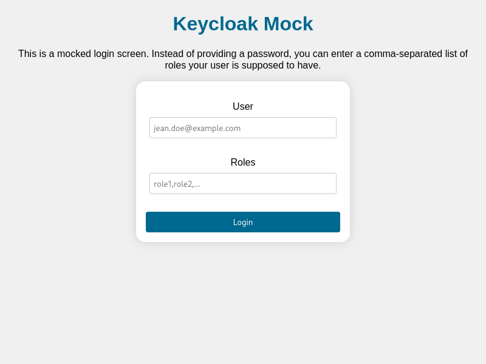

[](https://github.com/TNG/keycloak-mock/actions?query=branch%3Amain)
[](https://sonarcloud.io/dashboard?id=TNG_keycloak-mock)
[](https://github.com/TNG/keycloak-mock/releases)
[](https://central.sonatype.com/search?namespace=com.tngtech.keycloakmock)
[](https://github.com/TNG/keycloak-mock/pkgs/container/keycloak-mock)

# Keycloak Mock

[Keycloak](https://www.keycloak.org) is a single sign-on solution that supports the [Open ID connect](https://openid.net/connect/) standard. However, it does not
deliver light-weight test support. This library is intended to fill that gap.

All artifacts are available on [Maven Central Repository](https://central.sonatype.com/search?namespace=com.tngtech.keycloakmock)
with group ID `com.tngtech.keycloakmock`.

## Recent changes

Have a look at our [release notes](https://github.com/TNG/keycloak-mock/releases) for recent
releases and changes.

## Testing authenticated backend calls

When testing a REST backend that is protected by Keycloak, the mock allows to generate valid access tokens with
configurable claims (e.g. roles).

You can create and start the mock directly from the `mock` artifact using Maven

```maven
<dependency>
    <groupId>com.tngtech.keycloakmock</groupId>
    <artifactId>mock</artifactId>
    <scope>test</scope>
    <version>0.20.0</version>
</dependency>
```

or Gradle

```gradle
testImplementation 'com.tngtech.keycloakmock:mock:0.20.0'
```

like this:

```java
import static com.tngtech.keycloakmock.api.ServerConfig.aServerConfig;

import com.tngtech.keycloakmock.api.KeycloakMock;

class Test {

  void checkSomething() {
    KeycloakMock mock = new KeycloakMock(aServerConfig().withPort(8000).withDefaultRealm("master").build());
    mock.start();

    // do your test stuff

    mock.stop();
  }

  void quarkusKeycloakMocks() {
    // to mock Keycloak without context path (v18.0.0+)
    KeycloakMock mockNoContextPath = new KeycloakMock(aServerConfig().withNoContextPath().build());
    // or to use custom one
    KeycloakMock mockCustomContextPath = new KeycloakMock(aServerConfig().withContextPath("/context-path").build());
    // if context path is not provided, '/auth' will be used as default due to backward compatibility reasons
    KeycloakMock mockDefaultContextPath = new KeycloakMock(aServerConfig().build());
    // ...
  }
}
```

You can also use the convenience wrapper `mock-junit` for JUnit4

```java
import com.tngtech.keycloakmock.junit.KeycloakMockRule;

public class Test {
  @ClassRule
  public static KeycloakMockRule mock = new KeycloakMockRule();

  // ...

}
```

or `mock-junit5` for JUnit5

```java
import com.tngtech.keycloakmock.junit5.KeycloakMockExtension;

class Test {
  @RegisterExtension
  static KeycloakMockExtension mock = new KeycloakMockExtension();

  // ...

}
```

to let JUnit start the mock for you.

You can then generate a token of your choosing by providing a TokenConfig:

```java
import static com.tngtech.keycloakmock.api.TokenConfig.aTokenConfig;

class Test {

  String accessToken = mock.getAccessToken(aTokenConfig().withRole("ROLE_ADMIN").build());

  // ...

}
```

For a more in-detail test case, please have a look at the [AuthenticationTest](example-backend/src/test/java/com/tngtech/keycloakmock/examplebackend/AuthenticationTest.java) in our example backend project.

## Testing frontends and E2E flows

In addition to generating and signing tokens programmatically, the mock also offers

* user login (using implicit or authorization code flow, including support for redirect
  to `http://localhost` and `urn:ietf:wg:oauth:2.0:oob` for desktop applications)
* client credentials authentication
* resource owner password credentials authentication (both for public and confidential clients)

Note that as this is a mock, all flows are allowed for any client. For simplicity, all successful
calls to the token endpoint return the same response including a refresh token, even for flows which
should not contain it according to the specifications.

Whenever an authentication flow would require a username and password, the mock accepts any input as valid.
It will extract name and email address from the username, and will interpret the password as a comma-separated list
of roles that will be present in the token's `realm_access` and / or `resource_access` roles (depending on the
configuration).



### Running the mock

In addition to including the mock in your existing JUnit tests, you can also run the mock as a standalone application.

For this, either download the self-contained `standalone` JAR from [Maven Central](https://central.sonatype.com/artifact/com.tngtech.keycloakmock/standalone/versions)
and run it:

```bash
$ java -jar standalone.jar &
[main] INFO com.tngtech.keycloakmock.standalone.Main - Server is running on http://localhost:8000
```

Or download and run the docker image from our [Github Container Registry](https://github.com/TNG/keycloak-mock/pkgs/container/keycloak-mock):

```bash
$ docker run ghcr.io/tng/keycloak-mock:latest
```

If you use the keycloak.js library for your frontend authentication, you simply need to point the `auth-server-url`
to the URL the mock is listening on. You can also use the mock in end-to-end tests, as it is e.g. compatible with
`cypress-keycloak`. Have a look at the [example-frontend-react](example-frontend-react) project on how either of this can be set up.

For more advanced use-cases, you can also configure the mock server using command line parameters.
You can use `--help` to get a list of all options:

```bash
$ java -jar standalone.jar --help
Usage: standalone [-hsV] [-p=<port>] [-rm=<loginRoleMapping>]
                  [-tl=<tokenLifespan>] [-a=AUDIENCE[,AUDIENCE...]]...
                  [-sc=SCOPE[,SCOPE...]]... [[-cp=<contextPath>] | -ncp]
Starts a stand-alone keycloak mock.
  -a, --audiences=AUDIENCE[,AUDIENCE...]
                      Audiences to set in the token in addition to the
                        client_id (default: [server]).
      -cp, --contextPath=<contextPath>
                      Keycloak context path (default: /auth). If present, must
                        be prefixed with '/', eg. --contextPath=/example-path
  -h, --help          Show this help message and exit.
      -ncp, --noContextPath
                      If present context path will not be used. Good for
                        mocking Keycloak 18.0.0+.
  -p, --port=<port>   The port on which to run (default: 8000).
      -rm, --roleMapping=<loginRoleMapping>
                      Where to add the roles given in the login dialog
                        (default: TO_REALM). Valid options: TO_REALM,
                        TO_RESOURCE, TO_BOTH
  -s, --https         Whether to use HTTPS instead of HTTP.
      -sc, --scopes=SCOPE[,SCOPE...]
                      Scopes to add to generated token (default: [openid]).
      -tl, --tokenLifespan=<tokenLifespan>
                      Lifespan of generated tokens (default: 10h). Valid values
                        are e.g. '10h', '15m', '3m45s'.
  -V, --version       Print version information and exit.
```

## Server method documentation

You can get a list of all implemented endpoints of the mock server at `http://localhost:8000/docs`. This is mainly meant
for checking if a specific endpoint you want to use is supported by the mock (yet).

## License

This project is licensed under the Apache 2.0 license (see [LICENSE](LICENSE)).
